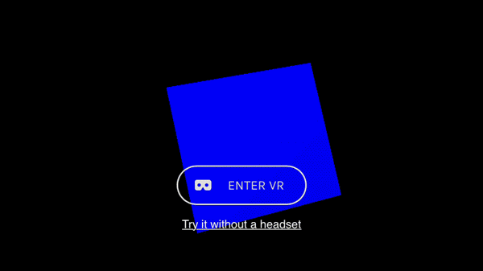

# Get started with VR in THREE.js... QUICK.

[![Latest NPM release][npm-badge]][npm-badge-url]
[![License][license-badge]][license-badge-url]
[![Dependencies][dependencies-badge]][dependencies-badge-url]

You'd probably do better just to use [aframe](https://aframe.io/), but if you need a way to fire up a vr scene in straight ahead THREE, this will get you going quick. [DEMO](http://halvves.com/three-quickvr/)

1. Install:
```bash
npm i -S three-quickvr
```

2. Use:
```javascript
import QuickVR from 'three-quickvr';
import {
  BoxGeometry,
  MeshLambertMaterial,
  Mesh,
  PointLight,
  Vector3,
} from 'three';

const app = new QuickVR();

const cube = new Mesh(
  new BoxGeometry(50, 50, 50),
  new MeshLambertMaterial({color: 0xffffff})
);
cube.position.set(0, 0, -150);
app.add(cube);

const light = new PointLight(0x0000ff);
light.position.set(0, 100, 200);
app.add(light);

const axis = new Vector3(0, 1, 1);
function animation() {
  cube.rotateOnAxis(axis, -0.01);
}
app.addAnimation(animation);

```

the above code will look something like this:



[npm-badge]: https://img.shields.io/npm/v/three-quickvr.svg
[npm-badge-url]: https://www.npmjs.com/package/three-quickvr
[license-badge]: https://img.shields.io/npm/l/three-quickvr.svg
[license-badge-url]: ./LICENSE.md
[dependencies-badge]: https://img.shields.io/david/halvves/three-quickvr.svg
[dependencies-badge-url]: https://david-dm.org/halvves/three-quickvr
